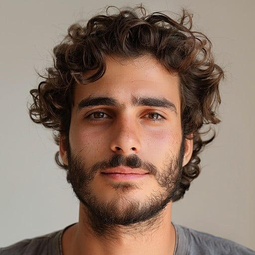
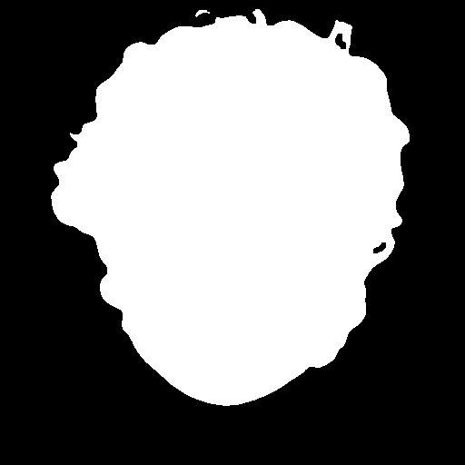
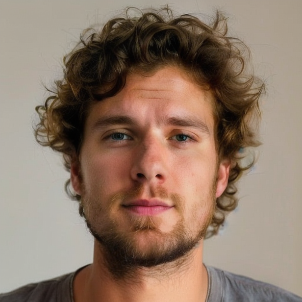

# Head Anonymization with Realistic Vision V5 and ControlNet

This repository provides a head-anonymization workflow that uses:
- **[head-segmentation](https://github.com/wiktorlazarski/head-segmentation)** for head masks
- **SG161222/Realistic_Vision_V5.0_noVAE** as the base model
- **ControlNet** for inpainting
- **DeepFace** for generating consistent demographic attributes (age, gender, race)

## Table of Contents
1. [Introduction](#introduction)  
2. [How It Works](#how-it-works)  
3. [Installation](#installation)  
4. [Usage](#usage)  
   - [Segment the Head](#segment-the-head)  
   - [Run the Anonymization](#run-the-anonymization)  
   - [Optional Prompts](#optional-prompts)  
5. [Output](#output)  
6. [Model & References](#model--references)
7. [License](#license)

---

## Introduction
This pipeline aims to anonymize faces while preserving certain identity-related features (like approximate age, race, and gender). By analyzing faces with [DeepFace](https://github.com/serengil/deepface), we build a Stable Diffusion prompt that matches the subject’s demographic attributes, ensuring a realistic yet anonymized result by staying above 0.6 cosine distance from the original image.

### **Example:**
**Prompt:**  
*A photorealistic portrait of a young adult White man, with a neutral expression, looking directly at the camera. Ultra-detailed, 8k resolution, professional photography.*

<table align="center">
  <tr>
    <td align="center">
      <a href="https://stockcake.com/i/curly-haired-man_689468_1156746">
        
      </a>
      <br><b>Sample Image</b>
    </td>
    <td align="center">
      
      <br><b>Mask</b>
    </td>
  </tr>
</table>

### **Output:**
<p align="center">
    
</p>


---

## How It Works

1. **Segment the Head**  
   We use [head-segmentation](https://github.com/wiktorlazarski/head-segmentation) to generate a mask of the head region in the input image.

2. **Analyze Demographics**  
   [DeepFace](https://github.com/serengil/deepface) analyzes the original face to predict:
   - Age
   - Gender
   - Race (dominant race)

3. **Generate Prompt**  
   A custom prompt is built using the analyzed demographic data. For example:
   ```
   "A photorealistic portrait of a {age_group} {race_descriptor} {gender}, with a neutral expression,
   looking directly at the camera. Ultra-detailed, 8k resolution, professional photography"
   ```

4. **Inpaint with ControlNet**  
   ControlNet uses the generated mask and the prompt to inpaint the head region in the style of **Realistic Vision V5**.

5. **Save the Results**  
   The anonymized image is saved, preserving the original image background but anonymizing the head region.

---

## Installation

1. **Clone the Repository**  
   ```bash
   git clone https://github.com/anilegin/face_anonymization.git
   cd face_anonymization
   ```
2. **Create a virtual environment (Optional)**  
   ```bash
   python -m venv anonymized_env
   source ./anonymized_env/bin/activate
   ```
3. **Install Dependencies**  
   Make sure you’re in a Python virtual environment, then run:
   ```bash
   pip install -r requirements.txt
   ```
   > **Note**: You may need to install system-level dependencies for PyTorch, e.g., CUDA, if you plan to run on GPU.
4. **Install Pre-trained weights for Realistic Vision v5.0**  
   Run:
   ```bash
   python download-weights
   ```

---

## Usage

### Segment the Head
Run the **segment** script to generate a head/face mask from your input image:
```bash
python segment.py --im_path path/to/your/image.png
```
- **Output**: The segmented mask is saved to the `./masks` folder by default.

### Run the Anonymization
Use the **predict** script to inpaint the face with a new identity:
```bash
python predict.py --image path/to/your/image.png --mask path/to/your/mask.png
```
- **Output**: The anonymized image is saved under the `./res` folder.

#### Optional Prompts
You can pass custom prompts if you want to override the defaults:
```bash
python predict.py \
   --image path/to/your/image.png \
   --mask path/to/your/mask.png \
   --prompt "A photorealistic portrait of a middle-aged Hispanic woman, neutral expression, looking at the camera" \
   --negative_prompt "ugly, blurry, low-res"
```
If not provided, the script uses **DeepFace** to detect age, race, gender, and builds an automated prompt accordingly.

---

## Output
- **Masks**: Saved in `./masks/<image_name>_mask.png`  
- **Anonymized Images**: Saved in `./res/<image_name>_out.png`

Example structure:
```
project/
├── masks
│   └── input_image_mask.png
├── res
│   └── input_image_out.png
```

---

## Model & References
- **Realistic Vision V5** model from:  
  [SG161222/Realistic_Vision_V5.0_noVAE](https://huggingface.co/SG161222/Realistic_Vision_V5.0_noVAE)  
- **Head Segmentation** from:  
  [wiktorlazarski/head-segmentation](https://github.com/wiktorlazarski/head-segmentation)  
- **DeepFace** for demographic analysis:  
  [DeepFace GitHub](https://github.com/serengil/deepface)

---

## License
- **Data & Model Usage**: Comply with each model’s license (for Realistic Vision, DeepFace, etc.).  
- **Code**:
MIT License
Copyright (c) 2025 ...
Permission is hereby granted, free of charge, to any person obtaining a copy ...

Feel free to open an issue or pull request for improvements and suggestions!

